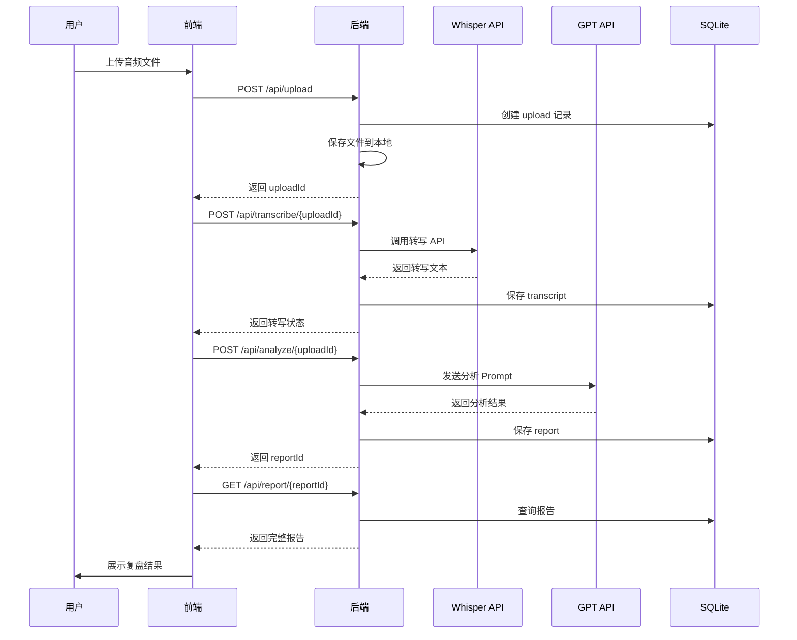

# 面试复盘系统 MVP 架构设计

## 系统架构图

```
┌─────────────────────────────────────────────────────────────────┐
│                         用户浏览器                                │
└─────────────────────┬───────────────────────────────────────────┘
                      │ HTTP/WebSocket
┌─────────────────────▼───────────────────────────────────────────┐
│                    Next.js 前端应用 (Port: 3000)                  │
│  ┌──────────────┐  ┌──────────────┐  ┌──────────────┐          │
│  │  上传页面     │  │  分析页面     │  │  结果展示     │          │
│  │  FileUpload  │  │  Processing  │  │  ReportView  │          │
│  └──────────────┘  └──────────────┘  └──────────────┘          │
└─────────────────────┬───────────────────────────────────────────┘
                      │ REST API
┌─────────────────────▼───────────────────────────────────────────┐
│               Node.js 后端服务 (Express) (Port: 8080)             │
│                                                                  │
│  ┌──────────────────────────────────────────────────────────┐   │
│  │                     API 路由层                            │   │
│  │  /upload  /transcribe  /analyze  /report  /status       │   │
│  └──────────────────────────────────────────────────────────┘   │
│                                                                  │
│  ┌──────────────┐  ┌──────────────┐  ┌──────────────┐         │
│  │  文件处理     │  │   ASR服务     │  │  LLM分析器    │         │
│  │  FileService │  │  WhisperAPI  │  │  OpenAIService│         │
│  └──────────────┘  └──────────────┘  └──────────────┘         │
│                                                                  │
│  ┌──────────────────────────────────────────────────────────┐   │
│  │                   SQLite 数据库                           │   │
│  │  sessions | uploads | transcripts | reports              │   │
│  └──────────────────────────────────────────────────────────┘   │
└──────────────────────────────────────────────────────────────────┘
                      │
┌─────────────────────▼───────────────────────────────────────────┐
│                    本地文件系统                                   │
│                 /uploads  /reports                               │
└──────────────────────────────────────────────────────────────────┘
```

## 核心模块说明

### 前端模块（Next.js）

1. **上传模块** (`/upload`)
   - 简单的拖拽上传界面
   - 支持 mp3, wav, m4a 格式
   - 文件大小限制：100MB
   - 上传进度显示

2. **处理状态模块** (`/processing`)
   - WebSocket 连接显示实时状态
   - 转写进度 → 分析进度
   - 错误处理和重试

3. **报告展示模块** (`/report/:id`)
   - 结构化展示复盘结果
   - 简单的 Markdown 渲染
   - 导出为 PDF（可选）

### 后端模块（Express）

1. **文件服务** (FileService)
   - 接收上传文件
   - 存储到本地 `/uploads` 目录
   - 文件元数据存入 SQLite

2. **ASR服务** (WhisperAPI)
   - 调用 OpenAI Whisper API
   - 返回带时间戳的转写文本
   - 简单的错误重试机制

3. **分析服务** (OpenAIService)
   - 单次 GPT-4 调用
   - 使用精心设计的 Prompt
   - 返回结构化的分析结果

4. **数据存储** (SQLite)
   - 最简单的关系型数据库
   - 存储会话、文件、结果
   - 无需额外配置

## 二、简化的技术栈

### 核心技术选型

| 层级 | 技术选择 | 理由 |
|------|----------|------|
| 前端框架 | Next.js 14 (App Router) | 全栈框架，开发效率高 |
| UI 组件 | shadcn/ui + Tailwind | 快速搭建，样式统一 |
| 后端框架 | Express.js | 简单成熟，生态丰富 |
| 数据库 | SQLite | 零配置，开发简单 |
| ASR | OpenAI Whisper API | 效果好，接入简单 |
| LLM | GPT-3.5-turbo | 成本低，速度快 |
| 文件存储 | 本地文件系统 | 无需外部服务 |
| 部署 | Docker Compose | 一键启动 |

### 开发工具

```json
{
  "开发语言": "TypeScript",
  "包管理": "pnpm",
  "代码规范": "ESLint + Prettier",
  "API文档": "简单的 README",
  "进程管理": "PM2（生产环境）"
}
```

## 三、数据流设计

### 主要数据流程



### API 设计（最小集）

```typescript
// 1. 文件上传
POST /api/upload
Request: FormData { file: File }
Response: { uploadId: string, filename: string }

// 2. 开始转写
POST /api/transcribe/:uploadId
Response: { status: "processing" | "completed", transcriptId?: string }

// 3. 获取转写结果
GET /api/transcript/:uploadId
Response: { text: string, segments: Array<{start: number, end: number, text: string}> }

// 4. 开始分析
POST /api/analyze/:uploadId
Request: { context?: string } // 可选的 JD 或其他上下文
Response: { reportId: string }

// 5. 获取分析报告
GET /api/report/:reportId
Response: {
  summary: string,
  strengths: string[],
  improvements: string[],
  suggestions: string[],
  score: number
}

// 6. 状态查询
GET /api/status/:uploadId
Response: {
  stage: "uploaded" | "transcribing" | "analyzing" | "completed",
  progress: number
}
```

## 四、数据库设计（最小化）

### SQLite 表结构

```sql
-- 1. 上传记录表
CREATE TABLE uploads (
    id TEXT PRIMARY KEY,
    filename TEXT NOT NULL,
    file_path TEXT NOT NULL,
    file_size INTEGER,
    mime_type TEXT,
    status TEXT DEFAULT 'uploaded',
    created_at TIMESTAMP DEFAULT CURRENT_TIMESTAMP
);

-- 2. 转写结果表
CREATE TABLE transcripts (
    id TEXT PRIMARY KEY,
    upload_id TEXT REFERENCES uploads(id),
    text TEXT NOT NULL,
    segments JSON, -- 存储时间戳段落
    word_count INTEGER,
    duration INTEGER, -- 音频时长（秒）
    created_at TIMESTAMP DEFAULT CURRENT_TIMESTAMP
);

-- 3. 分析报告表
CREATE TABLE reports (
    id TEXT PRIMARY KEY,
    upload_id TEXT REFERENCES uploads(id),
    transcript_id TEXT REFERENCES transcripts(id),
    summary TEXT,
    analysis JSON, -- 存储结构化分析结果
    score INTEGER,
    created_at TIMESTAMP DEFAULT CURRENT_TIMESTAMP
);

-- 4. 简单的会话表（可选）
CREATE TABLE sessions (
    id TEXT PRIMARY KEY,
    user_agent TEXT,
    ip_address TEXT,
    created_at TIMESTAMP DEFAULT CURRENT_TIMESTAMP,
    last_active TIMESTAMP
);
```

## 五、MVP vs 完整版对比

### 功能对比表

| 功能模块 | MVP 版本 | 完整版本 |
|----------|----------|----------|
| **音频处理** |
| 音频上传 | ✅ 本地上传 | ✅ 本地 + 云存储 |
| 音频转写 | ✅ Whisper API | ✅ Whisper + 说话人分离 |
| 实时转写 | ❌ | ✅ 流式处理 |
| **分析功能** |
| 基础复盘 | ✅ 单次 GPT 分析 | ✅ 多Agent协作分析 |
| 技术深度评估 | ⚠️ 简单评分 | ✅ 多维度深度评估 |
| 个性化建议 | ❌ | ✅ 基于历史的个性化 |
| **用户功能** |
| 用户认证 | ❌ | ✅ OAuth + JWT |
| 历史记录 | ❌ | ✅ 完整历史管理 |
| 简历/JD管理 | ❌ | ✅ 智能匹配 |
| **技术架构** |
| 部署方式 | Docker Compose | Kubernetes |
| 数据库 | SQLite | PostgreSQL + Redis |
| 消息队列 | ❌ | RabbitMQ/Kafka |
| 向量数据库 | ❌ | Pinecone/Weaviate |
| 监控告警 | ❌ | Prometheus + Grafana |

### MVP 核心指标

- **开发时间**: 1-2周
- **成本**: < $50/月（主要是 API 调用费用）
- **性能**: 支持 10-20 并发用户
- **代码量**: ~2000 行
- **部署复杂度**: 低（单机 Docker）

## 六、升级路径

### Phase 1: MVP (Week 1-2)
```
✅ 基础音频上传和转写
✅ 简单的 LLM 分析
✅ 基本的结果展示
✅ Docker 部署
```

### Phase 2: 增强功能 (Week 3-4)
```
⬜ 添加用户认证（NextAuth）
⬜ 历史记录功能
⬜ 改进分析 Prompt
⬜ 优化 UI/UX
```

### Phase 3: 智能化升级 (Month 2)
```
⬜ 引入 LangGraph 复杂工作流
⬜ 添加向量数据库
⬜ 实现记忆系统
⬜ 多轮对话分析
```

### Phase 4: 企业级功能 (Month 3)
```
⬜ 微服务改造
⬜ Kubernetes 部署
⬜ 监控和告警系统
⬜ 多租户支持
```

## 七、快速启动指南

### 环境准备

```bash
# 1. 克隆代码
git clone <repo>
cd interview-replay-mvp

# 2. 环境变量配置
cp .env.example .env
# 编辑 .env 添加 OpenAI API Key

# 3. 安装依赖
pnpm install

# 4. 初始化数据库
pnpm db:init

# 5. 启动开发环境
pnpm dev
```

### Docker 部署

```yaml
# docker-compose.yml
version: '3.8'
services:
  app:
    build: .
    ports:
      - "3000:3000"
      - "8080:8080"
    volumes:
      - ./uploads:/app/uploads
      - ./data:/app/data
    environment:
      - OPENAI_API_KEY=${OPENAI_API_KEY}
      - NODE_ENV=production
```

```bash
# 一键启动
docker-compose up -d
```

## 八、MVP 项目结构

```
interview-replay-mvp/
├── apps/
│   ├── web/                 # Next.js 前端
│   │   ├── app/             # App Router
│   │   ├── components/      # React 组件
│   │   └── lib/            # 工具函数
│   └── api/                # Express 后端
│       ├── src/
│       │   ├── routes/     # API 路由
│       │   ├── services/   # 业务逻辑
│       │   └── utils/      # 工具函数
│       └── db/             # SQLite 数据库
├── packages/
│   └── shared/             # 共享类型定义
├── docker-compose.yml
├── .env.example
└── README.md
```

## 九、风险和限制

### MVP 限制
1. **并发限制**: SQLite 不适合高并发写入
2. **存储限制**: 本地存储受磁盘空间限制
3. **API 成本**: OpenAI API 调用需要付费
4. **安全性**: 缺少用户认证和权限控制
5. **可靠性**: 单点故障，无冗余备份

### 缓解措施
1. 添加上传大小限制（100MB）
2. 定期清理旧文件
3. 使用 GPT-3.5 降低成本
4. 添加简单的 rate limiting
5. 定期备份 SQLite 数据库

## 十、总结

这个 MVP 架构设计遵循了 **"简单、快速、可用"** 的原则：

- **极简架构**: 前后端分离的单体应用
- **快速开发**: 1-2周完成核心功能
- **低成本**: 月成本 < $50
- **易部署**: Docker Compose 一键启动
- **可扩展**: 清晰的升级路径

MVP 版本专注于核心价值验证，通过最小的投入快速获得用户反馈，为后续的完整版本开发提供方向。