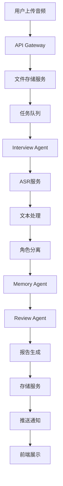
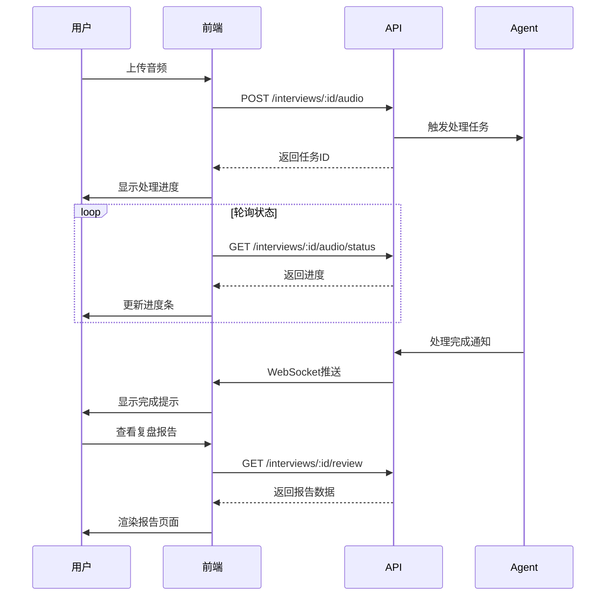
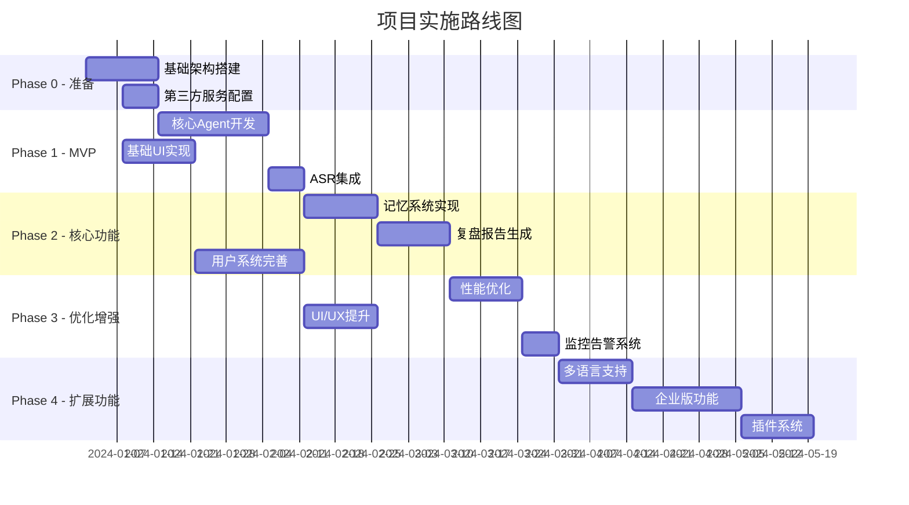

# 面试复盘全栈Agent系统 - 系统架构设计

## 文档信息
- **项目名称**: Interview Replay Agent System (IRAS)
- **版本**: v1.0
- **更新日期**: 2025-11-25
- **架构师**: Claude Code
- **文档状态**: 设计阶段

---

## 目录
- [1. 系统架构设计](#1-系统架构设计)
- [2. 技术栈选型](#2-技术栈选型)
- [3. Agent工作流设计](#3-agent工作流设计)
- [4. 记忆系统设计](#4-记忆系统设计)
- [5. 数据流设计](#5-数据流设计)
- [6. API设计](#6-api设计)
- [7. 前端架构](#7-前端架构)
- [8. 后端架构](#8-后端架构)
- [9. 扩展性和性能考虑](#9-扩展性和性能考虑)

---

## 1. 系统架构设计

### 1.1 整体架构模式

采用 **微服务化的前后端分离架构** 结合 **Agent 编排层**：

```
┌──────────────────────────────────────────────────────────┐
│                      客户端层                              │
├──────────────────────────────────────────────────────────┤
│         Next.js Web App          │    Mobile App (Future) │
└──────────────────────────────────────────────────────────┘
                           ↓
┌──────────────────────────────────────────────────────────┐
│                     API Gateway                           │
│              (Auth, Rate Limit, Routing)                  │
└──────────────────────────────────────────────────────────┘
                           ↓
┌──────────────────────────────────────────────────────────┐
│                    服务层 (Microservices)                  │
├─────────────┬─────────────┬──────────────┬──────────────┤
│   Core API  │  Agent      │   ASR        │   Storage    │
│   Service   │  Service    │   Service    │   Service    │
└─────────────┴─────────────┴──────────────┴──────────────┘
                           ↓
┌──────────────────────────────────────────────────────────┐
│                      数据层                                │
├─────────────┬─────────────┬──────────────┬──────────────┤
│ PostgreSQL  │   Redis     │  Vector DB   │   S3/OSS     │
│  (主数据库)  │   (缓存)    │  (Pinecone)  │  (文件存储)   │
└─────────────┴─────────────┴──────────────┴──────────────┘
```

### 1.2 核心模块划分

#### 前端模块
- **interview-upload**: 面试录音上传模块
- **transcript-review**: 文本审核编辑模块
- **report-viewer**: 复盘报告查看模块
- **profile-manager**: 个人简历/JD管理
- **history-manager**: 历史面试管理

#### 后端核心API
- **auth-service**: 认证授权
- **user-service**: 用户管理
- **interview-service**: 面试会话管理
- **report-service**: 报告生成管理

#### Agent服务
- **interview-agent**: 面试处理Agent
- **review-agent**: 复盘分析Agent
- **memory-agent**: 记忆管理Agent

#### AI服务
- **asr-service**: 语音识别服务
- **llm-service**: LLM调用封装
- **embedding-service**: 向量化服务

#### 存储服务
- **file-manager**: 文件存储管理
- **vector-store**: 向量存储管理
- **cache-manager**: 缓存管理

### 1.3 服务间通信方式

#### 同步通信
- **协议**: HTTP/REST
- **格式**: JSON
- **认证**: JWT Bearer Token

#### 异步通信
- **消息代理**: Redis Pub/Sub + Bull Queue
- **模式**:
  - Request-Reply（请求-响应）
  - Publish-Subscribe（发布-订阅）
  - Task Queue（任务队列）

#### 流式通信
- **协议**: Server-Sent Events (SSE)
- **应用场景**:
  - ASR实时转写进度
  - Agent处理进度
  - 报告生成进度

#### 内部通信
- **协议**: gRPC
- **应用场景**:
  - 高频内部服务调用
  - 二进制数据传输

### 1.4 部署架构

#### 容器化
- **平台**: Docker
- **编排**: Kubernetes

#### 环境配置
1. **开发环境**: docker-compose + hot-reload
2. **测试环境**: kubernetes (single-node) + automated testing
3. **生产环境**: kubernetes (multi-node) + auto-scaling + load-balancing

#### 基础设施
- **云平台**: AWS/阿里云
- **服务**:
  - EKS/ACK (Kubernetes)
  - RDS (PostgreSQL)
  - ElastiCache (Redis)
  - S3/OSS (对象存储)
  - CloudFront/CDN

---

## 2. 技术栈选型

### 2.1 前端技术栈

```typescript
// 核心框架
framework: Next.js 14
router: App Router
language: TypeScript 5.x

// UI层
styling: Tailwind CSS
components: shadcn/ui
animations: Framer Motion
icons: Lucide Icons

// 状态管理
global: Zustand
server: TanStack Query v5
forms: React Hook Form + Zod

// 工具库
http: Axios
date: date-fns
audio: WaveSurfer.js
markdown: react-markdown
pdf: react-pdf

// 开发工具
bundler: Turbo + Next.js
linting: ESLint + Prettier
testing: Jest + React Testing Library
```

**选型理由**:
- **Next.js 14**: SSR支持、SEO友好、App Router提供更好的路由体验
- **shadcn/ui**: 基于Radix UI的高质量组件库，可定制性强
- **Zustand**: 轻量级状态管理，比Redux简单，比Context性能更好
- **TanStack Query**: 服务端状态管理最佳实践，内置缓存和重试机制

### 2.2 后端技术栈

```typescript
// 核心
runtime: Node.js 20 LTS
language: TypeScript 5.x
framework: Express + Fastify (混合)

// 数据库
primary: PostgreSQL 15
cache: Redis 7
vector: Pinecone

// 消息队列
queue: Bull (Redis-based)
pubsub: Redis Pub/Sub

// 工具库
orm: Prisma
validation: Zod
auth: Passport + JWT
logging: Winston + Morgan
monitoring: Prometheus + Grafana

// 开发工具
build: esbuild
watch: nodemon
testing: Jest + Supertest
```

**选型理由**:
- **Express + Fastify**: Express处理REST API，Fastify处理高性能场景
- **Prisma**: 现代化ORM，类型安全，迁移管理优秀
- **PostgreSQL**: 成熟稳定，支持全文搜索，JSON支持好
- **Bull Queue**: 成熟的任务队列，可视化Dashboard，易于监控

### 2.3 AI/Agent 技术栈

```typescript
// Agent框架
orchestration: @langchain/langgraph
llm: @langchain/openai

// LLM选择
primary: GPT-4 Turbo
fallback: GPT-3.5 Turbo
embedding: text-embedding-3-small

// 向量数据库
vectorDB: Pinecone
alternatives: [Weaviate, Qdrant]

// ASR服务
primary: Azure Speech Services
fallback: OpenAI Whisper API
local: Whisper (self-hosted)

// 记忆系统
shortTerm: Redis
longTerm: PostgreSQL + Pinecone

// 工具库
chunking: langchain/text-splitter
prompting: Custom Template Engine
```

**选型理由**:
- **LangGraph**: 状态管理清晰，工作流可视化，易于调试
- **GPT-4 Turbo**: 最强推理能力，适合复杂分析任务
- **Pinecone**: 托管向量数据库，性能优秀，易于扩展
- **Azure Speech**: 中文识别准确率高，支持实时流式识别

---

## 3. Agent工作流设计

### 3.1 面试Agent详细工作流

```typescript
interface InterviewAgentState {
  audioFile?: Buffer;
  rawTranscript?: string;
  speakers?: Speaker[];
  correctedTranscript?: string;
  segments?: TranscriptSegment[];
  metadata?: InterviewMetadata;
}

const interviewWorkflow = new StateGraph<InterviewAgentState>({
  nodes: {
    // 节点1: 音频预处理
    preprocessAudio: async (state) => {
      // 音频格式转换、降噪、分段
      return { processedAudio: processed };
    },

    // 节点2: ASR转写
    transcribeAudio: async (state) => {
      // 调用ASR服务
      // 支持长音频分段处理
      return { rawTranscript: transcript };
    },

    // 节点3: 说话人分离
    diarization: async (state) => {
      // 识别不同说话人
      // 基于声学特征和对话模式
      return { speakers: speakers };
    },

    // 节点4: 文本修正
    correctTranscript: async (state) => {
      // LLM修正ASR错误
      // 专业术语校正
      // 标点符号优化
      return { correctedTranscript: corrected };
    },

    // 节点5: 角色识别
    identifyRoles: async (state) => {
      // 识别面试官/候选人
      // 基于对话内容和模式
      return { segments: roleSegments };
    },

    // 节点6: 元数据提取
    extractMetadata: async (state) => {
      // 提取公司、岗位、轮次等信息
      return { metadata: metadata };
    },
  },

  edges: [
    { from: 'START', to: 'preprocessAudio', condition: hasAudio },
    { from: 'START', to: 'correctTranscript', condition: hasRawText },
    { from: 'preprocessAudio', to: 'transcribeAudio' },
    { from: 'transcribeAudio', to: 'diarization' },
    { from: 'diarization', to: 'correctTranscript' },
    { from: 'correctTranscript', to: 'identifyRoles' },
    { from: 'identifyRoles', to: 'extractMetadata' },
    { from: 'extractMetadata', to: 'END' },
  ],
});
```

**工作流图示**:
```
START
  ├─[有音频]→ preprocessAudio → transcribeAudio
  └─[有文本]→ correctTranscript
                ↓
          diarization (说话人分离)
                ↓
          correctTranscript (文本修正)
                ↓
          identifyRoles (角色识别)
                ↓
          extractMetadata (元数据提取)
                ↓
              END
```

### 3.2 复盘Agent详细工作流

```typescript
interface ReviewAgentState {
  transcript: RoleBasedTranscript;
  resume?: Resume;
  jobDescription?: JobDescription;
  previousReviews?: Review[];
  analysis?: InterviewAnalysis;
  report?: ReviewReport;
}

const reviewWorkflow = new StateGraph<ReviewAgentState>({
  nodes: {
    // 节点1: 加载记忆
    loadMemory: async (state) => {
      // 从向量数据库加载相关记忆
      // 包括简历、JD、历史面试
      return {
        resume: resume,
        jobDescription: jd,
        previousReviews: reviews
      };
    },

    // 节点2: 自我介绍分析
    analyzeIntroduction: async (state) => {
      // 提取并评估自我介绍
      // 对比简历信息
      return { introAnalysis: analysis };
    },

    // 节点3: 问题识别
    identifyQuestions: async (state) => {
      // 识别所有面试问题
      // 分类：技术/行为/情境
      return { questions: questionList };
    },

    // 节点4: 答案评估
    evaluateAnswers: async (state) => {
      // 对每个答案进行评估
      // 技术准确性、逻辑性、表达能力
      return { evaluations: answerEvals };
    },

    // 节点5: 生成参考答案
    generateReferences: async (state) => {
      // 基于JD和问题生成参考答案
      // 结合行业最佳实践
      return { references: refAnswers };
    },

    // 节点6: 总体评估
    overallAssessment: async (state) => {
      // 综合评分
      // 强项和改进点
      return { assessment: overall };
    },

    // 节点7: 建议生成
    generateSuggestions: async (state) => {
      // 个性化改进建议
      // 学习路径推荐
      return { suggestions: suggestions };
    },

    // 节点8: 报告合成
    synthesizeReport: async (state) => {
      // 生成结构化复盘报告
      // 支持多种输出格式
      return { report: finalReport };
    },
  },

  edges: [
    { from: 'START', to: 'loadMemory' },
    { from: 'loadMemory', to: 'analyzeIntroduction' },
    { from: 'analyzeIntroduction', to: 'identifyQuestions' },
    { from: 'identifyQuestions', to: 'evaluateAnswers' },
    { from: 'evaluateAnswers', to: 'generateReferences' },
    { from: 'generateReferences', to: 'overallAssessment' },
    { from: 'overallAssessment', to: 'generateSuggestions' },
    { from: 'generateSuggestions', to: 'synthesizeReport' },
    { from: 'synthesizeReport', to: 'END' },
  ],
});
```

**工作流图示**:
```
START → loadMemory (加载记忆)
          ↓
    analyzeIntroduction (自我介绍分析)
          ↓
    identifyQuestions (问题识别)
          ↓
    evaluateAnswers (答案评估)
          ↓
    generateReferences (生成参考答案)
          ↓
    overallAssessment (总体评估)
          ↓
    generateSuggestions (建议生成)
          ↓
    synthesizeReport (报告合成)
          ↓
        END
```

### 3.3 Agent间协作机制

```typescript
class AgentCoordinator {
  private interviewAgent: InterviewAgent;
  private reviewAgent: ReviewAgent;
  private memoryAgent: MemoryAgent;
  private eventBus: EventEmitter;

  async processInterview(input: InterviewInput): Promise<ReviewReport> {
    // 阶段1: 面试处理
    const transcript = await this.interviewAgent.process(input);

    // 触发记忆更新
    this.eventBus.emit('transcript:ready', transcript);

    // 阶段2: 记忆增强
    const context = await this.memoryAgent.enhanceContext({
      userId: input.userId,
      jobId: input.jobId,
      transcript: transcript,
    });

    // 阶段3: 复盘分析
    const report = await this.reviewAgent.analyze({
      transcript: transcript,
      context: context,
    });

    // 阶段4: 记忆持久化
    await this.memoryAgent.persist({
      interview: transcript,
      review: report,
    });

    return report;
  }
}
```

### 3.4 错误处理和重试策略

```typescript
// 重试配置
const retryConfig = {
  // ASR服务重试
  asr: {
    maxRetries: 3,
    backoff: 'exponential', // 1s, 2s, 4s
    retryableErrors: ['TIMEOUT', 'RATE_LIMIT', 'SERVICE_UNAVAILABLE'],
  },

  // LLM调用重试
  llm: {
    maxRetries: 5,
    backoff: 'exponential',
    retryableErrors: ['RATE_LIMIT', 'TIMEOUT', 'OVERLOADED'],
    fallbackModel: 'gpt-3.5-turbo', // 降级到更便宜的模型
  },

  // 向量数据库重试
  vectorDB: {
    maxRetries: 3,
    backoff: 'linear', // 1s, 2s, 3s
    retryableErrors: ['NETWORK_ERROR', 'TIMEOUT'],
  },
};

// 错误恢复策略
const errorRecovery = {
  // 部分失败继续执行
  partialFailure: {
    asr: '使用低质量转写继续',
    diarization: '不区分说话人继续',
    correction: '使用原始文本继续',
  },

  // 完全失败通知用户
  criticalFailure: {
    asr: '通知用户上传音频失败，建议手动输入',
    llm: '通知用户分析服务暂时不可用',
  },
};
```

---

## 4. 记忆系统设计

### 4.1 记忆存储方案

```typescript
interface MemoryStorage {
  // 结构化数据 - PostgreSQL
  structured: {
    users: User[];
    resumes: Resume[];
    jobDescriptions: JobDescription[];
    interviews: Interview[];
    reviews: Review[];
  };

  // 向量数据 - Pinecone
  vectors: {
    resumeEmbeddings: VectorStore;
    jdEmbeddings: VectorStore;
    questionBankEmbeddings: VectorStore;
    answerPatternsEmbeddings: VectorStore;
  };

  // 会话缓存 - Redis
  cache: {
    activeConversations: Map<string, Conversation>;
    recentQueries: LRUCache<string, QueryResult>;
    userContext: Map<string, UserContext>;
  };
}
```

**存储层次**:
1. **热数据** (Redis): 当前会话、最近查询结果
2. **温数据** (PostgreSQL): 用户信息、面试记录、复盘报告
3. **冷数据** (向量数据库): 历史知识、参考答案库、问题模式

### 4.2 记忆检索策略

```typescript
class MemoryRetrieval {
  // 混合检索策略
  async retrieve(query: Query): Promise<Memory[]> {
    // 1. 关键词搜索 (PostgreSQL全文搜索)
    const keywordResults = await this.searchByKeywords(query);

    // 2. 语义搜索 (Pinecone向量检索)
    const semanticResults = await this.searchBySemantic(query);

    // 3. 时序相关 (最近的相关记忆)
    const temporalResults = await this.searchByTemporal(query);

    // 4. 混合排序
    return this.hybridRanking([
      ...keywordResults,
      ...semanticResults,
      ...temporalResults,
    ]);
  }

  // 上下文感知检索
  async contextAwareRetrieval(
    query: Query,
    context: Context
  ): Promise<Memory[]> {
    // 根据当前面试轮次调整检索策略
    if (context.round === 1) {
      // 第一轮更关注基础和简历匹配
      return this.retrieveForFirstRound(query, context);
    } else {
      // 后续轮次关注深度和之前的反馈
      return this.retrieveForLaterRounds(query, context);
    }
  }
}
```

**检索优先级**:
1. **第一轮面试**: 简历匹配 > 岗位要求 > 行业通用知识
2. **后续轮次**: 上轮反馈 > 历史面试模式 > 深度技术知识

### 4.3 记忆更新机制

```typescript
class MemoryUpdate {
  // 增量更新
  async incrementalUpdate(newMemory: Memory): Promise<void> {
    // 1. 去重检查
    const isDuplicate = await this.checkDuplicate(newMemory);
    if (isDuplicate) return;

    // 2. 冲突解决
    const conflicts = await this.detectConflicts(newMemory);
    if (conflicts.length > 0) {
      newMemory = await this.resolveConflicts(newMemory, conflicts);
    }

    // 3. 向量化
    const embedding = await this.embed(newMemory);

    // 4. 多存储同步更新
    await Promise.all([
      this.updateStructured(newMemory),
      this.updateVector(embedding),
      this.invalidateCache(newMemory.relatedKeys),
    ]);
  }

  // 批量更新优化
  async batchUpdate(memories: Memory[]): Promise<void> {
    // 使用事务确保一致性
    await this.db.transaction(async (trx) => {
      for (const memory of memories) {
        await this.updateWithTransaction(memory, trx);
      }
    });
  }
}
```

### 4.4 上下文管理

```typescript
interface ContextManager {
  // 短期上下文 (当前对话)
  shortTerm: {
    currentInterview: Interview;
    activeTopics: string[];
    conversationHistory: Message[];
    maxTokens: 4000; // GPT-4 context window的一部分
  };

  // 中期上下文 (当前会话)
  mediumTerm: {
    userProfile: UserProfile;
    currentJobApplication: JobApplication;
    sessionGoals: Goal[];
    ttl: 3600; // 1小时
  };

  // 长期上下文 (用户历史)
  longTerm: {
    interviewHistory: Interview[];
    performanceTrends: Trend[];
    learningProgress: Progress[];
    persistent: true;
  };
}
```

---

## 5. 数据流设计

### 5.1 端到端数据流图



### 5.2 数据格式定义

```typescript
// 面试数据模型
export const InterviewSchema = z.object({
  id: z.string().uuid(),
  userId: z.string().uuid(),
  jobId: z.string().uuid(),
  round: z.number().min(1).max(10),

  audio: z.object({
    url: z.string().url(),
    duration: z.number(), // seconds
    format: z.enum(['mp3', 'wav', 'm4a', 'webm']),
    size: z.number(), // bytes
  }).optional(),

  transcript: z.object({
    raw: z.string(),
    corrected: z.string(),
    segments: z.array(z.object({
      speaker: z.enum(['interviewer', 'candidate', 'unknown']),
      text: z.string(),
      startTime: z.number(),
      endTime: z.number(),
      confidence: z.number().min(0).max(1),
    })),
  }),

  metadata: z.object({
    company: z.string(),
    position: z.string(),
    department: z.string().optional(),
    interviewType: z.enum(['technical', 'behavioral', 'mixed']),
    duration: z.number(),
    language: z.string().default('zh-CN'),
  }),

  timestamps: z.object({
    uploadedAt: z.date(),
    processedAt: z.date().optional(),
    reviewedAt: z.date().optional(),
  }),
});

export type Interview = z.infer<typeof InterviewSchema>;

// 复盘报告数据模型
export const ReviewReportSchema = z.object({
  id: z.string().uuid(),
  interviewId: z.string().uuid(),

  overview: z.object({
    interviewRound: z.number(),
    position: z.string(),
    overallScore: z.number().min(0).max(100),
    strengths: z.array(z.string()),
    improvements: z.array(z.string()),
  }),

  introduction: z.object({
    content: z.string(),
    evaluation: z.string(),
    score: z.number().min(0).max(100),
  }).optional(),

  questions: z.array(z.object({
    id: z.string(),
    question: z.string(),
    category: z.enum(['technical', 'behavioral', 'situational']),
    answer: z.string(),
    evaluation: z.object({
      score: z.number().min(0).max(100),
      strengths: z.array(z.string()),
      weaknesses: z.array(z.string()),
      suggestions: z.array(z.string()),
    }),
    referenceAnswer: z.string().optional(),
  })),

  overallAssessment: z.object({
    technicalSkills: z.number().min(0).max(100),
    communicationSkills: z.number().min(0).max(100),
    problemSolving: z.number().min(0).max(100),
    culturalFit: z.number().min(0).max(100),
    summary: z.string(),
  }),

  recommendations: z.array(z.object({
    category: z.string(),
    priority: z.enum(['high', 'medium', 'low']),
    action: z.string(),
    resources: z.array(z.string()).optional(),
  })),

  generatedAt: z.date(),
});

export type ReviewReport = z.infer<typeof ReviewReportSchema>;
```

### 5.3 数据持久化策略

```yaml
persistence:
  strategies:
    hot-data:  # 热数据 (7天内)
      storage: Redis
      ttl: 7d
      pattern: Cache-Aside

    warm-data:  # 温数据 (7-30天)
      storage: PostgreSQL
      indexes: [userId, jobId, createdAt]
      partitioning: by-month

    cold-data:  # 冷数据 (30天+)
      storage: S3
      compression: gzip
      lifecycle: archive-after-90d

  backup:
    frequency: daily
    retention: 30d
    strategy: incremental
    destination: S3-backup-bucket

  migration:
    tool: Prisma Migrate
    strategy: blue-green
    rollback: automatic-on-failure
```

### 5.4 缓存策略

```typescript
const cacheStrategy = {
  // 用户信息缓存
  user: {
    pattern: 'Cache-Aside',
    ttl: 3600, // 1小时
    invalidateOn: ['user:update', 'user:delete'],
  },

  // 面试列表缓存
  interviewList: {
    pattern: 'Cache-Aside',
    ttl: 300, // 5分钟
    invalidateOn: ['interview:create', 'interview:update'],
  },

  // 复盘报告缓存
  review: {
    pattern: 'Read-Through',
    ttl: 86400, // 24小时
    invalidateOn: ['review:update'],
  },

  // ASR结果缓存
  transcript: {
    pattern: 'Write-Through',
    ttl: 604800, // 7天
    persistent: true, // 同时写入数据库
  },
};
```

---

## 6. API设计

### 6.1 RESTful API端点设计

#### 认证相关
```
POST   /api/auth/register         # 注册新用户
POST   /api/auth/login            # 用户登录
POST   /api/auth/refresh          # 刷新token
POST   /api/auth/logout           # 用户登出
POST   /api/auth/reset-password   # 重置密码
```

#### 面试管理
```
GET    /api/interviews            # 获取面试列表
POST   /api/interviews            # 创建新面试
GET    /api/interviews/:id        # 获取面试详情
PUT    /api/interviews/:id        # 更新面试信息
DELETE /api/interviews/:id        # 删除面试
```

#### 音频处理
```
POST   /api/interviews/:id/audio           # 上传音频文件
GET    /api/interviews/:id/audio/status    # 查询处理状态
GET    /api/interviews/:id/audio/download  # 下载原始音频
```

#### 文本处理
```
GET    /api/interviews/:id/transcript           # 获取转写文本
PUT    /api/interviews/:id/transcript           # 更新转写文本
POST   /api/interviews/:id/transcript/correct   # 请求文本修正
```

#### 复盘报告
```
POST   /api/interviews/:id/review      # 生成复盘报告
GET    /api/interviews/:id/review      # 获取复盘报告
PUT    /api/interviews/:id/review      # 更新复盘报告
GET    /api/interviews/:id/review/pdf  # 导出PDF格式
GET    /api/interviews/:id/review/md   # 导出Markdown格式
```

#### 个人信息管理
```
GET    /api/profile          # 获取用户资料
PUT    /api/profile          # 更新用户资料
POST   /api/profile/resume   # 上传简历
GET    /api/profile/resumes  # 获取简历列表
DELETE /api/profile/resumes/:id  # 删除简历
```

#### 岗位管理
```
GET    /api/jobs        # 获取岗位列表
POST   /api/jobs        # 创建岗位
GET    /api/jobs/:id    # 获取岗位详情
PUT    /api/jobs/:id    # 更新岗位
DELETE /api/jobs/:id    # 删除岗位
```

#### 统计分析
```
GET    /api/stats/overview   # 用户统计概览
GET    /api/stats/progress   # 面试进度
GET    /api/stats/trends     # 表现趋势分析
```

### 6.2 WebSocket实时通信

```typescript
interface RealtimeEvents {
  // 客户端 -> 服务器
  'audio:stream:start': (data: { interviewId: string }) => void;
  'audio:stream:chunk': (data: { chunk: ArrayBuffer }) => void;
  'audio:stream:end': () => void;

  // 服务器 -> 客户端
  'processing:started': (data: { interviewId: string }) => void;
  'processing:progress': (data: {
    stage: string;
    progress: number;
  }) => void;
  'processing:completed': (data: {
    interviewId: string;
    resultUrl: string;
  }) => void;
  'processing:error': (data: {
    error: string;
    code: string;
  }) => void;

  // 实时转写
  'transcript:partial': (data: { text: string }) => void;
  'transcript:final': (data: {
    segment: TranscriptSegment
  }) => void;
}
```

### 6.3 API鉴权方案

```typescript
export const authStrategy = {
  // JWT配置
  jwt: {
    accessToken: {
      secret: process.env.JWT_ACCESS_SECRET,
      expiresIn: '15m',
      algorithm: 'RS256',
    },
    refreshToken: {
      secret: process.env.JWT_REFRESH_SECRET,
      expiresIn: '7d',
      algorithm: 'RS256',
    },
  },

  // 权限级别
  roles: {
    FREE: ['read:own', 'write:own:limited'],
    PREMIUM: ['read:own', 'write:own', 'export:own'],
    ENTERPRISE: ['read:all', 'write:all', 'admin:team'],
    ADMIN: ['*'],
  },

  // API限流
  rateLimit: {
    FREE: {
      interviews: '5/day',
      reviews: '10/day',
      apiCalls: '100/hour',
    },
    PREMIUM: {
      interviews: '20/day',
      reviews: '50/day',
      apiCalls: '1000/hour',
    },
    ENTERPRISE: {
      interviews: 'unlimited',
      reviews: 'unlimited',
      apiCalls: '10000/hour',
    },
  },
};
```

### 6.4 API文档规范

采用 **OpenAPI 3.0** 规范，使用 **Swagger UI** 提供交互式文档。

```yaml
# openapi.yaml 示例
openapi: 3.0.0
info:
  title: Interview Replay Agent API
  version: 1.0.0
  description: 面试复盘Agent系统API文档

servers:
  - url: https://api.interview-replay.com/v1
    description: 生产环境
  - url: https://staging-api.interview-replay.com/v1
    description: 测试环境

paths:
  /interviews:
    get:
      summary: 获取面试列表
      security:
        - bearerAuth: []
      parameters:
        - name: page
          in: query
          schema:
            type: integer
            default: 1
        - name: limit
          in: query
          schema:
            type: integer
            default: 20
      responses:
        '200':
          description: 成功
          content:
            application/json:
              schema:
                $ref: '#/components/schemas/InterviewList'
```

---

## 7. 前端架构

### 7.1 页面结构和路由

```typescript
export const routes = {
  // 公共页面
  '/': 'Landing page - 产品介绍',
  '/login': 'Login page - 用户登录',
  '/register': 'Registration page - 用户注册',
  '/pricing': 'Pricing plans - 价格方案',

  // 认证后页面
  '/dashboard': 'User dashboard - 用户主面板',

  // 面试管理
  '/interviews': 'Interview list - 面试列表',
  '/interviews/new': 'New interview - 创建面试',
  '/interviews/[id]': 'Interview details - 面试详情',
  '/interviews/[id]/transcript': 'Transcript editor - 文本编辑器',
  '/interviews/[id]/review': 'Review report - 复盘报告',

  // 个人中心
  '/profile': 'User profile - 用户资料',
  '/profile/resume': 'Resume management - 简历管理',
  '/profile/jobs': 'Job positions - 岗位管理',
  '/profile/settings': 'Settings - 系统设置',

  // 分析统计
  '/analytics': 'Analytics dashboard - 分析面板',
  '/analytics/trends': 'Performance trends - 表现趋势',
  '/analytics/insights': 'AI insights - AI洞察',
};
```

### 7.2 组件设计

#### 布局组件
```typescript
// layouts/AppLayout.tsx
export function AppLayout({ children }) {
  return (
    <div className="min-h-screen bg-background">
      <Header />
      <Sidebar />
      <main className="ml-64 p-6">{children}</main>
      <Footer />
    </div>
  );
}
```

#### 业务组件
```typescript
// 音频上传组件
interface AudioUploaderProps {
  onUpload: (file: File) => Promise<void>;
  maxSize?: number; // MB
  formats?: string[];
}

// 转写编辑器组件
interface TranscriptEditorProps {
  transcript: Transcript;
  onSave: (transcript: Transcript) => Promise<void>;
  speakers: Speaker[];
  readonly?: boolean;
}

// 复盘报告组件
interface ReviewReportProps {
  report: ReviewReport;
  editable?: boolean;
  onExport?: (format: 'pdf' | 'md') => void;
}

// 波形播放器组件
interface WaveformPlayerProps {
  audioUrl: string;
  peaks?: number[];
  segments?: AudioSegment[];
  onSeek?: (time: number) => void;
}
```

### 7.3 状态管理方案

```typescript
// stores/userStore.ts - 用户状态
export const useUserStore = create<UserState>((set) => ({
  user: null,
  isAuthenticated: false,
  login: async (credentials) => {
    const user = await authService.login(credentials);
    set({ user, isAuthenticated: true });
  },
  logout: () => {
    authService.logout();
    set({ user: null, isAuthenticated: false });
  },
  updateProfile: (profile) => {
    set((state) => ({ user: { ...state.user, ...profile } }));
  },
}));

// stores/interviewStore.ts - 面试状态
export const useInterviewStore = create<InterviewState>((set) => ({
  interviews: [],
  currentInterview: null,
  isProcessing: false,
  uploadAudio: async (file) => {
    set({ isProcessing: true });
    try {
      const interview = await interviewService.uploadAudio(file);
      set((state) => ({
        interviews: [interview, ...state.interviews],
        currentInterview: interview,
        isProcessing: false,
      }));
    } catch (error) {
      set({ isProcessing: false });
      throw error;
    }
  },
}));

// stores/uiStore.ts - UI状态
export const useUIStore = create<UIState>((set) => ({
  theme: 'light',
  sidebarOpen: true,
  notifications: [],
  addNotification: (notification) => {
    set((state) => ({
      notifications: [...state.notifications, notification],
    }));
  },
  toggleSidebar: () => {
    set((state) => ({ sidebarOpen: !state.sidebarOpen }));
  },
}));
```

### 7.4 用户交互流程



---

## 8. 后端架构

### 8.1 服务分层

```typescript
// 控制器层 (Controller) - 处理HTTP请求
@Controller('/interviews')
export class InterviewController {
  constructor(private service: InterviewService) {}

  @Post('/')
  @UseGuards(AuthGuard)
  @RateLimit({ max: 10, window: '1h' })
  async create(@Body() dto: CreateInterviewDto, @User() user) {
    // 1. 请求验证 (通过Zod schema)
    // 2. 权限检查 (通过Guard)
    // 3. 调用服务层
    return this.service.create(dto, user.id);
  }

  @Get('/:id')
  async getOne(@Param('id') id: string) {
    return this.service.findById(id);
  }
}

// 服务层 (Service) - 业务逻辑
@Injectable()
export class InterviewService {
  constructor(
    private repo: InterviewRepository,
    private agentService: AgentService,
    private storageService: StorageService
  ) {}

  async create(dto: CreateInterviewDto, userId: string) {
    // 1. 业务规则验证
    await this.validateUserQuota(userId);

    // 2. 创建面试记录
    const interview = await this.repo.create({
      ...dto,
      userId,
      status: 'pending',
    });

    // 3. 异步处理音频
    if (dto.audioFile) {
      await this.queueAudioProcessing(interview.id, dto.audioFile);
    }

    return interview;
  }

  private async queueAudioProcessing(interviewId, audioFile) {
    // 添加到任务队列
    await this.queue.add('process-audio', {
      interviewId,
      audioFile,
    });
  }
}

// 仓库层 (Repository) - 数据访问
@Repository()
export class InterviewRepository {
  constructor(private prisma: PrismaService) {}

  async create(data: CreateInterviewData) {
    return this.prisma.interview.create({
      data,
      include: {
        user: true,
        job: true,
      },
    });
  }

  async findById(id: string) {
    return this.prisma.interview.findUnique({
      where: { id },
      include: {
        transcript: true,
        review: true,
      },
    });
  }

  async findByUser(userId: string, options: PaginationOptions) {
    return this.prisma.interview.findMany({
      where: { userId },
      skip: options.skip,
      take: options.take,
      orderBy: { createdAt: 'desc' },
    });
  }
}
```

### 8.2 业务逻辑组织

```typescript
// 面试处理业务逻辑
export class InterviewProcessingService {
  // 完整的处理流程
  async processInterview(interviewId: string) {
    try {
      // 1. 获取面试数据
      const interview = await this.repo.findById(interviewId);

      // 2. 更新状态为处理中
      await this.updateStatus(interviewId, 'processing');

      // 3. 下载音频文件
      const audioBuffer = await this.storageService.download(
        interview.audioUrl
      );

      // 4. 调用Interview Agent
      const transcript = await this.agentService.processAudio({
        audio: audioBuffer,
        metadata: interview.metadata,
      });

      // 5. 保存转写结果
      await this.repo.updateTranscript(interviewId, transcript);

      // 6. 触发复盘分析
      await this.queueReviewGeneration(interviewId);

      // 7. 更新状态为完成
      await this.updateStatus(interviewId, 'completed');

      // 8. 发送通知
      await this.notificationService.send(interview.userId, {
        type: 'interview_processed',
        interviewId,
      });
    } catch (error) {
      // 错误处理
      await this.updateStatus(interviewId, 'failed');
      await this.notificationService.send(interview.userId, {
        type: 'interview_failed',
        interviewId,
        error: error.message,
      });
      throw error;
    }
  }
}
```

### 8.3 数据访问层设计

```typescript
// Prisma Schema
model User {
  id        String   @id @default(uuid())
  email     String   @unique
  name      String
  avatar    String?
  role      Role     @default(FREE)

  resumes   Resume[]
  jobs      Job[]
  interviews Interview[]

  createdAt DateTime @default(now())
  updatedAt DateTime @updatedAt

  @@index([email])
}

model Interview {
  id          String   @id @default(uuid())
  userId      String
  jobId       String
  round       Int      @default(1)

  audioUrl    String?
  audioDuration Int?

  status      InterviewStatus @default(PENDING)

  user        User     @relation(fields: [userId], references: [id])
  job         Job      @relation(fields: [jobId], references: [id])
  transcript  Transcript?
  review      Review?

  createdAt   DateTime @default(now())
  updatedAt   DateTime @updatedAt

  @@index([userId, createdAt])
  @@index([jobId])
}

model Transcript {
  id            String   @id @default(uuid())
  interviewId   String   @unique

  raw           String   @db.Text
  corrected     String   @db.Text
  segments      Json     // TranscriptSegment[]

  interview     Interview @relation(fields: [interviewId], references: [id])

  createdAt     DateTime @default(now())
  updatedAt     DateTime @updatedAt
}

model Review {
  id            String   @id @default(uuid())
  interviewId   String   @unique

  overallScore  Int
  report        Json     // ReviewReport

  interview     Interview @relation(fields: [interviewId], references: [id])

  createdAt     DateTime @default(now())
  updatedAt     DateTime @updatedAt
}

enum InterviewStatus {
  PENDING
  PROCESSING
  COMPLETED
  FAILED
}

enum Role {
  FREE
  PREMIUM
  ENTERPRISE
  ADMIN
}
```

### 8.4 异步任务处理

```typescript
// queue/processors/audioProcessor.ts
export const audioProcessor = async (job: Job) => {
  const { interviewId, audioUrl } = job.data;

  // 更新进度 0%
  await job.progress(0);

  try {
    // 1. 下载音频 (20%)
    const audioBuffer = await downloadAudio(audioUrl);
    await job.progress(20);

    // 2. 音频预处理 (30%)
    const processed = await preprocessAudio(audioBuffer);
    await job.progress(30);

    // 3. ASR转写 (70%)
    const transcript = await transcribeAudio(processed, (progress) => {
      job.progress(30 + progress * 0.4);
    });
    await job.progress(70);

    // 4. 说话人分离 (80%)
    const diarized = await diarizeAudio(transcript);
    await job.progress(80);

    // 5. 文本修正 (90%)
    const corrected = await correctTranscript(diarized);
    await job.progress(90);

    // 6. 保存结果 (100%)
    await saveTranscript(interviewId, corrected);
    await job.progress(100);

    return { success: true, interviewId };
  } catch (error) {
    throw new Error(`Audio processing failed: ${error.message}`);
  }
};

// queue/processors/reviewProcessor.ts
export const reviewProcessor = async (job: Job) => {
  const { interviewId } = job.data;

  try {
    // 1. 加载数据
    const interview = await loadInterview(interviewId);
    const context = await loadUserContext(interview.userId);

    // 2. 运行Review Agent
    const report = await runReviewAgent(interview, context);

    // 3. 保存报告
    await saveReview(interviewId, report);

    // 4. 发送通知
    await sendNotification(interview.userId, {
      type: 'review_ready',
      interviewId,
    });

    return { success: true, interviewId };
  } catch (error) {
    throw new Error(`Review generation failed: ${error.message}`);
  }
};
```

---

## 9. 扩展性和性能考虑

### 9.1 系统扩展点

```yaml
extensibility:
  # 插件系统
  plugins:
    - custom-asr-providers    # 自定义ASR提供商
    - custom-llm-providers    # 自定义LLM提供商
    - custom-export-formats   # 自定义导出格式
    - custom-scoring-rules    # 自定义评分规则

  # Webhook系统
  webhooks:
    events:
      - interview.created
      - interview.processed
      - review.generated
      - user.upgraded
    configuration:
      url: string
      secret: string
      retry: number

  # API扩展
  api:
    - GraphQL endpoint       # 图查询支持
    - gRPC services         # 高性能内部通信
    - OpenAPI spec          # API文档自动生成

  # Agent扩展
  agents:
    - custom-node-types     # 自定义节点类型
    - custom-workflows      # 自定义工作流
    - plugin-marketplace    # 插件市场
```

### 9.2 性能优化策略

#### 缓存策略
```yaml
caching:
  layers:
    - CDN: 静态资源 (HTML, CSS, JS, 图片)
    - Redis: 热数据 (用户信息, 会话)
    - Application: 计算结果 (分析报告)
    - Database: 查询缓存 (常见查询结果)

  strategies:
    cache-aside:  # 旁路缓存
      - 用户信息
      - 面试列表
    read-through:  # 读穿透
      - 复盘报告
    write-through:  # 写穿透
      - 转写结果
    write-behind:  # 写后置
      - 用户行为日志
```

#### 数据库优化
```typescript
// 索引优化
const indexes = {
  users: ['email', 'createdAt'],
  interviews: [
    'userId',
    'jobId',
    ['userId', 'createdAt'],  // 复合索引
    ['status', 'createdAt'],
  ],
  transcripts: ['interviewId'],
  reviews: ['interviewId'],
};

// 查询优化
// ❌ 避免 N+1 查询
const interviews = await prisma.interview.findMany();
for (const interview of interviews) {
  const review = await prisma.review.findUnique({
    where: { interviewId: interview.id },
  });
}

// ✅ 使用 include 一次性加载
const interviews = await prisma.interview.findMany({
  include: {
    review: true,
    transcript: true,
  },
});

// 连接池管理
const poolConfig = {
  min: 2,
  max: 10,
  acquireTimeoutMillis: 30000,
  idleTimeoutMillis: 30000,
};

// 读写分离
const readDB = createPrismaClient({ url: READ_DATABASE_URL });
const writeDB = createPrismaClient({ url: WRITE_DATABASE_URL });
```

#### 异步处理
```typescript
// 消息队列配置
const queueConfig = {
  audio: {
    concurrency: 3,  // 同时处理3个音频任务
    priority: 'high',
    attempts: 3,
    backoff: {
      type: 'exponential',
      delay: 2000,
    },
  },

  review: {
    concurrency: 5,  // 同时生成5个报告
    priority: 'medium',
    attempts: 3,
  },

  notification: {
    concurrency: 10,  // 同时发送10个通知
    priority: 'low',
    attempts: 5,
  },
};

// 批量处理
async function batchProcess(items: Item[], batchSize = 100) {
  for (let i = 0; i < items.length; i += batchSize) {
    const batch = items.slice(i, i + batchSize);
    await Promise.all(batch.map(item => processItem(item)));
  }
}
```

#### 前端优化
```typescript
// Code splitting
const ReviewReport = dynamic(() => import('./ReviewReport'), {
  loading: () => <Skeleton />,
  ssr: false,
});

// 虚拟滚动
import { VirtualList } from 'react-window';

function InterviewList({ interviews }) {
  return (
    <VirtualList
      height={600}
      itemCount={interviews.length}
      itemSize={80}
      width="100%"
    >
      {({ index, style }) => (
        <InterviewItem
          key={interviews[index].id}
          interview={interviews[index]}
          style={style}
        />
      )}
    </VirtualList>
  );
}

// 图片优化
import Image from 'next/image';

<Image
  src="/avatar.jpg"
  width={100}
  height={100}
  alt="用户头像"
  placeholder="blur"
  loading="lazy"
/>
```

### 9.3 监控和日志

```typescript
// 指标收集
const metricsConfig = {
  system: [
    'cpu_usage',
    'memory_usage',
    'disk_io',
    'network_traffic',
  ],

  application: [
    'api_response_time',
    'request_throughput',
    'error_rate',
    'agent_processing_time',
    'asr_transcription_duration',
  ],

  business: [
    'daily_active_users',
    'interviews_processed',
    'reviews_generated',
    'user_satisfaction_score',
  ],
};

// 日志策略
const loggingConfig = {
  levels: ['error', 'warn', 'info', 'debug'],

  structured: {
    format: 'JSON',
    fields: [
      'timestamp',
      'level',
      'service',
      'traceId',
      'userId',
      'message',
      'metadata',
    ],
  },

  storage: {
    shortTerm: 'CloudWatch/阿里云日志服务',
    longTerm: 'S3/OSS',
    retention: '90 days',
  },
};

// 告警规则
const alertsConfig = {
  critical: {
    'error_rate > 5%': 'PagerDuty',
    'response_time > 3s': 'Slack + Email',
    'system_down': 'Phone call',
  },

  warning: {
    'error_rate > 1%': 'Slack',
    'queue_size > 1000': 'Email',
    'disk_usage > 80%': 'Dashboard',
  },
};
```

### 9.4 可维护性设计

```yaml
maintainability:
  # 文档化
  documentation:
    - API文档 (Swagger/OpenAPI)
    - 架构文档 (C4 Model)
    - 部署文档 (Runbook)
    - 开发指南 (Contributing Guide)

  # 代码质量
  code_quality:
    - 单元测试覆盖率 > 80%
    - 集成测试
    - E2E测试
    - 代码审查流程
    - 静态代码分析 (ESLint, Prettier, TypeScript)

  # 部署流程
  deployment:
    - Blue-Green部署
    - 自动回滚
    - Feature Flags
    - 灰度发布 (Canary Deployment)
    - 环境隔离 (Dev, Staging, Prod)

  # 依赖管理
  dependencies:
    - 定期更新 (Dependabot)
    - 安全扫描 (Snyk)
    - License检查
    - 版本锁定 (package-lock.json)
```

---

## 10. 关键决策和权衡

### 10.1 技术选型权衡

| 决策点 | 选择 | 理由 | 权衡 |
|--------|------|------|------|
| **前端框架** | Next.js 14 | SSR支持、生态成熟、TypeScript友好 | 学习曲线相对陡峭 |
| **Agent框架** | LangGraph | 状态管理清晰、可视化好 | 社区相对较小 |
| **向量数据库** | Pinecone | 托管服务、性能优秀 | 成本较高、vendor lock-in |
| **ASR服务** | Azure Speech | 中文识别准确率高 | 成本考虑、需要备用方案 |
| **部署方式** | Kubernetes | 弹性伸缩、容器化 | 运维复杂度高 |
| **数据库** | PostgreSQL | 成熟稳定、功能丰富 | 扩展性不如NoSQL |
| **缓存** | Redis | 高性能、多数据结构 | 需要额外维护 |
| **消息队列** | Bull (Redis) | 简单易用、可视化好 | 功能不如RabbitMQ |

### 10.2 架构决策记录 (ADR)

#### ADR-001: 采用微服务架构

**状态**: 已接受

**背景**: 需要构建一个可扩展、高可用的面试复盘系统。

**决策**: 采用微服务架构，将系统拆分为多个独立服务。

**原因**:
1. 各服务可独立扩展
2. 技术栈灵活选择
3. 故障隔离
4. 团队并行开发

**后果**:
- **正面**: 扩展性好、容错性强、技术灵活
- **负面**: 复杂度增加、运维成本高、网络延迟

**缓解措施**:
- 使用API Gateway简化通信
- 采用DevOps实践降低运维成本
- 渐进式拆分，从单体开始

---

#### ADR-002: 选择LangGraph作为Agent框架

**状态**: 已接受

**背景**: 需要构建复杂的AI Agent工作流。

**决策**: 使用LangGraph而非LangChain或自研框架。

**原因**:
1. 状态图模型清晰
2. 可视化工作流
3. 易于调试和监控
4. LangChain生态系统支持

**后果**:
- **正面**: 开发效率高、可维护性好
- **负面**: 社区较小、学习资源少

**缓解措施**:
- 建立内部知识库
- 参与社区贡献
- 保持与LangChain更新同步

---

#### ADR-003: 使用PostgreSQL + Pinecone混合存储

**状态**: 已接受

**背景**: 需要同时处理结构化数据和向量数据。

**决策**: PostgreSQL存储结构化数据，Pinecone存储向量数据。

**原因**:
1. PostgreSQL成熟稳定，支持复杂查询
2. Pinecone专注向量检索，性能优秀
3. 各司其职，发挥各自优势

**后果**:
- **正面**: 性能最优、功能完整
- **负面**: 数据同步复杂、成本较高

**缓解措施**:
- 设计清晰的数据同步策略
- 利用Pinecone免费层降低成本
- 考虑pgvector作为替代方案

---

## 11. 实施路线图



**关键里程碑**:
- **M0**: 环境就绪 (第5天)
- **M1**: MVP完成 (第35天) - 基础音频上传和转写功能
- **M2**: 智能分析上线 (第63天) - LangGraph分析引擎完成
- **M3**: 记忆系统完成 (第84天) - 向量数据库和知识管理
- **M4**: 产品发布 (第126天) - 系统部署上线

---

## 12. 总结

### 核心优势

1. **模块化设计** - 清晰的服务边界和职责分离
2. **Agent编排** - 基于LangGraph的灵活工作流
3. **智能记忆** - 混合存储和智能检索策略
4. **实时处理** - 支持流式处理和实时反馈
5. **可扩展性** - 插件系统和微服务架构
6. **生产就绪** - 完整的监控、日志和容错机制

### 技术亮点

- **全栈TypeScript** - 类型安全贯穿前后端
- **AI原生架构** - 深度集成LLM和向量数据库
- **现代化技术栈** - Next.js 14、Prisma、LangGraph
- **云原生设计** - 容器化、微服务、Kubernetes
- **开发者友好** - 清晰的文档、规范的代码

### 适用场景

- ✅ **个人学习项目** - 适合1-3人小团队开发
- ✅ **创业MVP** - 快速验证商业模式
- ✅ **技术探索** - 实践AI Agent和全栈开发
- ✅ **面试准备** - 展示全栈和AI能力

---

## 附录

### A. 术语表

- **ASR**: Automatic Speech Recognition（自动语音识别）
- **LangGraph**: LangChain的图状态工作流框架
- **LLM**: Large Language Model（大语言模型）
- **SSR**: Server-Side Rendering（服务端渲染）
- **JWT**: JSON Web Token（JSON Web令牌）
- **ORM**: Object-Relational Mapping（对象关系映射）
- **MVP**: Minimum Viable Product（最小可行产品）

### B. 参考资源

- [Next.js 文档](https://nextjs.org/docs)
- [LangGraph 文档](https://langchain-ai.github.io/langgraph/)
- [Prisma 文档](https://www.prisma.io/docs)
- [Pinecone 文档](https://docs.pinecone.io/)
- [Azure Speech 文档](https://docs.microsoft.com/azure/cognitive-services/speech-service/)

### C. 更新日志

| 版本 | 日期 | 更新内容 |
|------|------|----------|
| v1.0 | 2025-11-25 | 初始版本，完整系统架构设计 |

---

**文档维护者**: Claude Code
**最后更新**: 2025-11-25
**审核状态**: 待审核
