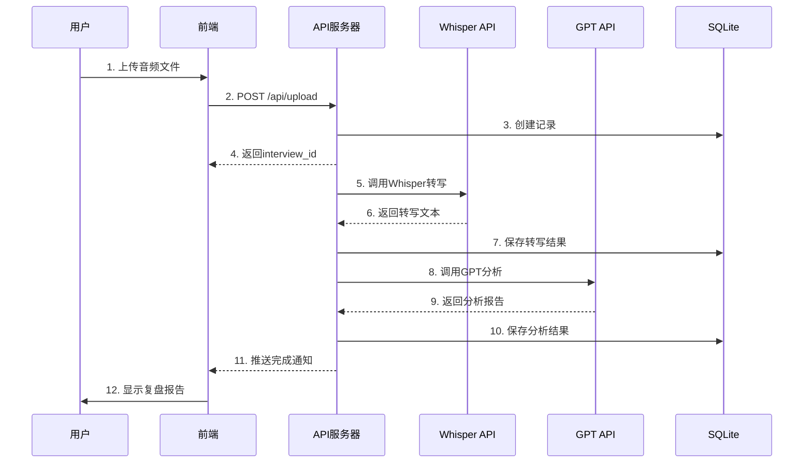

# 面试复盘Agent系统 - MVP架构设计

## 文档信息
- **项目名称**: Interview Replay Agent System - MVP
- **版本**: v1.0-mvp
- **更新日期**: 2025-11-25
- **目标周期**: 7-10个工作日
- **文档状态**: MVP版本

---

## 📋 目录
- [1. MVP目标和范围](#1-mvp目标和范围)
- [2. 极简架构设计](#2-极简架构设计)
- [3. 技术栈选型](#3-技术栈选型)
- [4. 核心功能设计](#4-核心功能设计)
- [5. 数据模型设计](#5-数据模型设计)
- [6. API设计](#6-api设计)
- [7. 部署方案](#7-部署方案)
- [8. MVP vs 完整版对比](#8-mvp-vs-完整版对比)

---

## 1. MVP目标和范围

### 1.1 核心价值主张

**一句话描述**: 用户上传面试录音，快速获得AI智能复盘报告

### 1.2 MVP必须包含的功能

✅ **必须有**:
1. 音频文件上传（本地存储）
2. ASR自动转写（OpenAI Whisper API）
3. 智能分析（GPT-3.5/GPT-4）
4. 复盘报告展示（网页显示）
5. 处理进度追踪

❌ **MVP不包含**:
- 用户认证系统（可选：简单session）
- 复杂的Agent工作流（不使用LangGraph）
- 向量数据库和记忆系统
- 历史面试记录管理
- 简历/JD结构化管理
- 微服务架构
- 生产级Kubernetes部署

### 1.3 成功指标

| 指标 | 目标 |
|------|------|
| **开发周期** | 7-10天 |
| **单次处理成本** | < $0.50 |
| **处理时间** | < 5分钟 (30分钟音频) |
| **转写准确率** | > 90% |
| **用户操作步骤** | ≤ 3步 |

---

## 2. 极简架构设计

### 2.1 整体架构

```
┌─────────────────────────────────────────┐
│           用户浏览器                      │
│         Next.js Frontend                 │
│    (React + TypeScript + Tailwind)       │
└─────────────────────────────────────────┘
                  ↓ HTTP/REST
┌─────────────────────────────────────────┐
│           API 服务器                      │
│         Express Backend                  │
│      (Node.js + TypeScript)              │
├─────────────────────────────────────────┤
│  ┌────────┐  ┌────────┐  ┌──────────┐  │
│  │ Upload │→ │Whisper │→ │   GPT    │  │
│  │Service │  │Service │  │ Service  │  │
│  └────────┘  └────────┘  └──────────┘  │
└─────────────────────────────────────────┘
                  ↓
┌─────────────────────────────────────────┐
│            本地存储                       │
│  ┌──────────┐         ┌──────────────┐ │
│  │  SQLite  │         │ 文件系统      │ │
│  │ (数据库)  │         │ (音频文件)    │ │
│  └──────────┘         └──────────────┘ │
└─────────────────────────────────────────┘
```

### 2.2 核心模块说明

#### 前端模块 (Next.js)
```
/app
├── page.tsx                    # 首页（上传页面）
├── interviews/
│   ├── page.tsx               # 面试列表
│   └── [id]/
│       ├── page.tsx           # 面试详情
│       └── transcript.tsx     # 转写文本展示
└── components/
    ├── AudioUploader.tsx      # 音频上传组件
    ├── ProcessingStatus.tsx   # 处理进度组件
    └── ReportViewer.tsx       # 报告查看组件
```

#### 后端模块 (Express)
```
/src
├── routes/
│   ├── upload.ts              # 文件上传路由
│   ├── interviews.ts          # 面试管理路由
│   └── analysis.ts            # 分析结果路由
├── services/
│   ├── whisperService.ts      # ASR服务
│   ├── gptService.ts          # LLM分析服务
│   ├── storageService.ts      # 文件存储服务
│   └── queueService.ts        # 简单任务队列
├── models/
│   └── interview.ts           # 数据模型
└── utils/
    ├── db.ts                  # SQLite连接
    └── logger.ts              # 日志工具
```

### 2.3 数据流图



---

## 3. 技术栈选型

### 3.1 前端技术栈

| 技术 | 版本 | 用途 | 理由 |
|------|------|------|------|
| **Next.js** | 14 | React框架 | SSR支持、路由简单、部署便捷 |
| **TypeScript** | 5.x | 类型系统 | 类型安全、减少错误 |
| **Tailwind CSS** | 3.x | 样式框架 | 快速开发、响应式设计 |
| **Zustand** | 4.x | 状态管理 | 轻量级、API简单 |
| **Axios** | 1.x | HTTP客户端 | 请求拦截、错误处理 |

### 3.2 后端技术栈

| 技术 | 版本 | 用途 | 理由 |
|------|------|------|------|
| **Node.js** | 20 LTS | 运行环境 | 统一语言、生态丰富 |
| **Express** | 4.x | Web框架 | 成熟稳定、中间件丰富 |
| **TypeScript** | 5.x | 类型系统 | 全栈类型安全 |
| **SQLite** | 3.x | 数据库 | 零配置、文件型数据库 |
| **Multer** | 1.x | 文件上传 | Express标准方案 |

### 3.3 AI/ASR服务

| 服务 | 用途 | 成本 | MVP选择 |
|------|------|------|---------|
| **OpenAI Whisper API** | 语音转文字 | $0.006/分钟 | ✅ 推荐 |
| **GPT-3.5-turbo** | 文本分析 | $0.002/1K tokens | ✅ 推荐 |
| **GPT-4-turbo** | 高质量分析 | $0.01/1K tokens | ⚠️ 可选 |

### 3.4 选型对比：MVP vs 完整版

| 组件 | MVP版本 | 完整版 | 差异说明 |
|------|---------|--------|----------|
| 前端框架 | Next.js | Next.js | 一致 |
| 后端架构 | 单体Express | 微服务 | MVP单体更简单 |
| 数据库 | SQLite | PostgreSQL + Redis | MVP无需独立数据库服务 |
| Agent框架 | 直接调用LLM | LangGraph | MVP跳过复杂编排 |
| 向量数据库 | 无 | Pinecone | MVP不需要记忆系统 |
| 文件存储 | 本地文件系统 | S3/OSS | MVP节省成本 |
| 部署 | Docker Compose | Kubernetes | MVP简化部署 |

---

## 4. 核心功能设计

### 4.1 音频上传功能

#### 前端上传组件
```typescript
// components/AudioUploader.tsx
interface AudioUploaderProps {
  onUploadComplete: (interviewId: string) => void;
}

export function AudioUploader({ onUploadComplete }: AudioUploaderProps) {
  // 功能要求:
  // 1. 拖拽上传支持
  // 2. 文件类型验证 (mp3, wav, m4a)
  // 3. 文件大小限制 (100MB)
  // 4. 上传进度显示
  // 5. 错误提示
}
```

#### 后端上传处理
```typescript
// routes/upload.ts
router.post('/upload', upload.single('audio'), async (req, res) => {
  // 1. 验证文件
  // 2. 生成唯一ID
  // 3. 保存文件到 uploads/YYYY-MM-DD/
  // 4. 创建数据库记录
  // 5. 触发异步处理任务
  // 6. 返回 interview_id
});
```

### 4.2 ASR转写功能

```typescript
// services/whisperService.ts
export class WhisperService {
  async transcribe(audioPath: string): Promise<TranscriptResult> {
    // 1. 检查文件大小
    // 2. 如果 > 25MB，分片处理
    // 3. 调用 OpenAI Whisper API
    // 4. 合并结果
    // 5. 返回转写文本

    const response = await openai.audio.transcriptions.create({
      file: fs.createReadStream(audioPath),
      model: 'whisper-1',
      language: 'zh', // 中文优化
      response_format: 'verbose_json', // 包含时间戳
    });

    return {
      text: response.text,
      segments: response.segments,
      duration: response.duration,
    };
  }
}
```

### 4.3 智能分析功能

```typescript
// services/gptService.ts
export class GPTService {
  async analyzeInterview(transcript: string): Promise<AnalysisResult> {
    const prompt = this.buildPrompt(transcript);

    const response = await openai.chat.completions.create({
      model: 'gpt-3.5-turbo',
      messages: [
        { role: 'system', content: SYSTEM_PROMPT },
        { role: 'user', content: prompt },
      ],
      temperature: 0.7,
      response_format: { type: 'json_object' },
    });

    return JSON.parse(response.choices[0].message.content);
  }

  private buildPrompt(transcript: string): string {
    return `
请分析以下面试对话，输出JSON格式的复盘报告：

## 面试对话
${transcript}

## 输出格式
{
  "summary": "面试总体概述",
  "questions": [
    {
      "question": "问题内容",
      "answer": "回答内容",
      "evaluation": "评价",
      "score": 85,
      "suggestions": ["建议1", "建议2"]
    }
  ],
  "strengths": ["优点1", "优点2"],
  "weaknesses": ["不足1", "不足2"],
  "overall_score": 80,
  "recommendations": ["改进建议1", "改进建议2"]
}
    `;
  }
}
```

### 4.4 处理进度追踪

```typescript
// 简单的进度追踪（内存存储）
class ProgressTracker {
  private progress = new Map<string, ProcessingProgress>();

  update(interviewId: string, stage: string, percentage: number) {
    this.progress.set(interviewId, {
      stage,
      percentage,
      timestamp: Date.now(),
    });
  }

  get(interviewId: string): ProcessingProgress | undefined {
    return this.progress.get(interviewId);
  }
}

// API端点
router.get('/interviews/:id/progress', (req, res) => {
  const progress = progressTracker.get(req.params.id);
  res.json(progress);
});
```

---

## 5. 数据模型设计

### 5.1 SQLite数据库Schema

```sql
-- schema.sql

-- 面试记录表
CREATE TABLE interviews (
  id INTEGER PRIMARY KEY AUTOINCREMENT,
  title TEXT NOT NULL,
  audio_path TEXT,
  audio_duration INTEGER,  -- 秒
  audio_size INTEGER,      -- 字节

  -- 转写结果
  transcript_text TEXT,
  transcript_segments TEXT, -- JSON格式

  -- 分析结果
  analysis_json TEXT,       -- JSON格式

  -- 状态管理
  status TEXT NOT NULL CHECK(status IN (
    'uploaded',
    'transcribing',
    'transcribed',
    'analyzing',
    'completed',
    'failed'
  )),

  error_message TEXT,

  -- 时间戳
  created_at DATETIME DEFAULT CURRENT_TIMESTAMP,
  updated_at DATETIME DEFAULT CURRENT_TIMESTAMP,
  completed_at DATETIME
);

-- 创建索引
CREATE INDEX idx_interviews_status ON interviews(status);
CREATE INDEX idx_interviews_created_at ON interviews(created_at DESC);

-- 更新时间戳触发器
CREATE TRIGGER update_interviews_timestamp
AFTER UPDATE ON interviews
BEGIN
  UPDATE interviews SET updated_at = CURRENT_TIMESTAMP
  WHERE id = NEW.id;
END;
```

### 5.2 TypeScript类型定义

```typescript
// types/interview.ts

export interface Interview {
  id: number;
  title: string;
  audioPath: string;
  audioDuration: number;
  audioSize: number;

  transcriptText?: string;
  transcriptSegments?: TranscriptSegment[];

  analysis?: AnalysisResult;

  status: InterviewStatus;
  errorMessage?: string;

  createdAt: Date;
  updatedAt: Date;
  completedAt?: Date;
}

export type InterviewStatus =
  | 'uploaded'
  | 'transcribing'
  | 'transcribed'
  | 'analyzing'
  | 'completed'
  | 'failed';

export interface TranscriptSegment {
  text: string;
  start: number;  // 秒
  end: number;    // 秒
  speaker?: 'interviewer' | 'candidate' | 'unknown';
}

export interface AnalysisResult {
  summary: string;
  questions: QuestionAnalysis[];
  strengths: string[];
  weaknesses: string[];
  overallScore: number;
  recommendations: string[];
}

export interface QuestionAnalysis {
  question: string;
  answer: string;
  evaluation: string;
  score: number;
  suggestions: string[];
}
```

---

## 6. API设计

### 6.1 RESTful API端点

#### 上传音频
```
POST /api/upload
Content-Type: multipart/form-data

请求:
- audio: File (音频文件)
- title: string (可选，面试标题)

响应:
{
  "success": true,
  "interviewId": "123",
  "message": "上传成功，正在处理..."
}
```

#### 获取面试列表
```
GET /api/interviews?page=1&limit=20

响应:
{
  "interviews": [
    {
      "id": 123,
      "title": "Frontend面试",
      "status": "completed",
      "duration": 1800,
      "createdAt": "2025-11-25T10:00:00Z"
    }
  ],
  "total": 50,
  "page": 1,
  "limit": 20
}
```

#### 获取面试详情
```
GET /api/interviews/:id

响应:
{
  "id": 123,
  "title": "Frontend面试",
  "status": "completed",
  "transcript": "...",
  "analysis": {
    "summary": "...",
    "questions": [...],
    "strengths": [...],
    "weaknesses": [...],
    "overallScore": 85,
    "recommendations": [...]
  },
  "createdAt": "2025-11-25T10:00:00Z",
  "completedAt": "2025-11-25T10:15:00Z"
}
```

#### 获取处理进度
```
GET /api/interviews/:id/progress

响应:
{
  "stage": "transcribing",  // uploaded, transcribing, analyzing, completed
  "percentage": 45,
  "message": "正在转写音频..."
}
```

#### 删除面试
```
DELETE /api/interviews/:id

响应:
{
  "success": true,
  "message": "删除成功"
}
```

### 6.2 错误处理

```typescript
// 统一错误响应格式
interface ErrorResponse {
  success: false;
  error: {
    code: string;
    message: string;
    details?: any;
  };
}

// 错误码定义
enum ErrorCode {
  INVALID_FILE = 'INVALID_FILE',
  FILE_TOO_LARGE = 'FILE_TOO_LARGE',
  TRANSCRIPTION_FAILED = 'TRANSCRIPTION_FAILED',
  ANALYSIS_FAILED = 'ANALYSIS_FAILED',
  NOT_FOUND = 'NOT_FOUND',
  INTERNAL_ERROR = 'INTERNAL_ERROR',
}
```

---

## 7. 部署方案

### 7.1 开发环境

```bash
# 启动开发服务器
npm run dev

# 前端: http://localhost:3000
# 后端: http://localhost:3001
```

### 7.2 Docker Compose部署

```yaml
# docker-compose.yml
version: '3.8'

services:
  # 前端服务
  frontend:
    build: ./frontend
    ports:
      - "3000:3000"
    environment:
      - NEXT_PUBLIC_API_URL=http://backend:3001
    depends_on:
      - backend
    restart: unless-stopped

  # 后端服务
  backend:
    build: ./backend
    ports:
      - "3001:3001"
    environment:
      - OPENAI_API_KEY=${OPENAI_API_KEY}
      - DATABASE_PATH=/data/interviews.db
      - UPLOAD_PATH=/data/uploads
      - NODE_ENV=production
    volumes:
      - ./data:/data
    restart: unless-stopped

volumes:
  data:
    driver: local
```

### 7.3 一键启动脚本

```bash
#!/bin/bash
# deploy.sh

echo "🚀 开始部署 MVP 版本..."

# 1. 检查环境变量
if [ -z "$OPENAI_API_KEY" ]; then
  echo "❌ 错误: 请设置 OPENAI_API_KEY 环境变量"
  exit 1
fi

# 2. 创建数据目录
mkdir -p ./data/uploads

# 3. 初始化数据库
sqlite3 ./data/interviews.db < ./backend/schema.sql

# 4. 构建并启动服务
docker-compose up --build -d

# 5. 等待服务启动
echo "⏳ 等待服务启动..."
sleep 10

# 6. 健康检查
if curl -f http://localhost:3001/health > /dev/null 2>&1; then
  echo "✅ 后端服务启动成功"
else
  echo "❌ 后端服务启动失败"
  docker-compose logs backend
  exit 1
fi

if curl -f http://localhost:3000 > /dev/null 2>&1; then
  echo "✅ 前端服务启动成功"
else
  echo "❌ 前端服务启动失败"
  docker-compose logs frontend
  exit 1
fi

echo "🎉 部署完成!"
echo "📱 访问地址: http://localhost:3000"
```

---

## 8. MVP vs 完整版对比

### 8.1 功能对比

| 功能模块 | MVP版本 | 完整版 | 优先级 |
|---------|---------|--------|--------|
| **音频上传** | ✅ 本地存储 | ✅ S3存储 | P0 |
| **ASR转写** | ✅ Whisper API | ✅ Whisper API + 本地备选 | P0 |
| **智能分析** | ✅ 直接调用GPT | ✅ LangGraph工作流 | P0 |
| **报告展示** | ✅ 简单网页 | ✅ 富文本编辑器 | P0 |
| **用户认证** | ❌ 无 | ✅ JWT认证 | P1 |
| **历史记录** | ⚠️ 简单列表 | ✅ 完整管理系统 | P1 |
| **记忆系统** | ❌ 无 | ✅ 向量数据库 | P2 |
| **简历管理** | ❌ 无 | ✅ 结构化管理 | P2 |
| **JD管理** | ❌ 无 | ✅ 岗位库 | P2 |
| **多轮面试** | ❌ 无 | ✅ 轮次关联 | P2 |
| **数据分析** | ❌ 无 | ✅ 统计图表 | P3 |
| **导出功能** | ⚠️ 文本复制 | ✅ PDF/Markdown | P3 |

### 8.2 架构演进路径

```
┌─────────────┐    ┌─────────────┐    ┌─────────────┐
│  MVP 版本   │ →  │  Beta 版本  │ →  │  生产版本   │
│  (1-2周)    │    │   (1个月)   │    │   (3个月)   │
└─────────────┘    └─────────────┘    └─────────────┘
      ↓                   ↓                   ↓
  单体应用           添加用户系统         微服务架构
  本地存储           Redis缓存           K8s部署
  SQLite            PostgreSQL          完整监控
  简单UI            优化体验            企业功能
```

### 8.3 成本对比

| 项目 | MVP版本 | 完整版 | 节省 |
|------|---------|--------|------|
| **开发时间** | 7-10天 | 65天 | 85% |
| **月运行成本** | ~$30 | ~$200 | 85% |
| **部署复杂度** | Docker Compose | Kubernetes | - |
| **维护成本** | 低 | 中高 | - |

### 8.4 何时升级到完整版

**升级触发条件**:
- ✅ MVP验证了产品价值
- ✅ 有10+个活跃用户
- ✅ 每天处理>20个面试
- ✅ 用户反馈需要高级功能
- ✅ 有预算支持完整开发

**升级步骤**:
1. **Phase 1**: 添加用户认证和权限系统
2. **Phase 2**: 引入Redis缓存和PostgreSQL
3. **Phase 3**: 实现向量数据库和记忆系统
4. **Phase 4**: 重构为微服务架构
5. **Phase 5**: 实现完整的监控和运维体系

---

## 9. 快速启动指南

### 9.1 环境准备

```bash
# 1. 克隆代码
git clone <repository-url>
cd agent-learning-fullstack

# 2. 安装依赖
cd frontend && npm install
cd ../backend && npm install

# 3. 配置环境变量
cp .env.example .env
# 编辑 .env 填入 OPENAI_API_KEY

# 4. 初始化数据库
npm run db:init

# 5. 启动开发服务器
npm run dev
```

### 9.2 快速测试

```bash
# 测试音频上传
curl -X POST http://localhost:3001/api/upload \
  -F "audio=@test.mp3" \
  -F "title=测试面试"

# 查看处理进度
curl http://localhost:3001/api/interviews/1/progress

# 获取分析结果
curl http://localhost:3001/api/interviews/1
```

---

## 10. 总结

### 核心优势

1. **极简设计** - 单体应用，快速开发
2. **低成本** - 月运行成本 < $50
3. **易部署** - Docker Compose一键启动
4. **快速验证** - 7-10天上线MVP
5. **可扩展** - 清晰的升级路径

### 适用场景

✅ **适合**:
- 个人学习项目
- 快速验证想法
- 小规模测试
- 技术demo展示

❌ **不适合**:
- 大规模生产环境
- 高并发场景
- 企业级应用
- 需要复杂权限管理

### 下一步

1. 阅读 [MVP开发计划](./mvp-development-plan.md)
2. 开始Day 0环境搭建
3. 按日计划逐步实施
4. 收集用户反馈
5. 决定是否升级到完整版

---

**文档维护者**: Claude Code
**最后更新**: 2025-11-25
**文档状态**: ✅ MVP版本已完成
